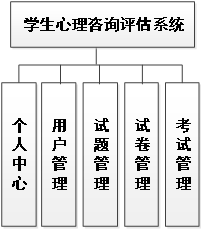

# 基于Springboot的学生心理咨询评估系统

## Springboot-0005


## 技术栈

Springboot mybatisplus vue mysql maven


## 数据库表(7张)


## 功能介绍

```properties
管理员
个人中心，用户管理，试题管理，考试管理，试卷管理
```


## 图片

### 前台

### 后台


## 访问路径

### 前台

```properties

```

### 后台

```properties
http://localhost:8080/springbootvtgh9/admin/dist/index.html#/login

账号 abo
密码 abo
```


## 功能图




## 文档目录


## 打赏或交流


